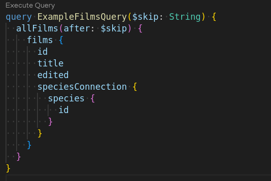

Provides inline operation execution capability throughout code files. Used by `graphql.vscode-graphql` extension, but can be used standalone with `graphql.vscode-graphql-syntax` as well.

Uses `@urql/core` under the hood.

## Features

### Codelens



### Supports

- `.graphql`/`.gql`/`.graphqls`
- `.js`, `.jsx`
- `.ts`, `.tsx`

### Coming Soon

- [ ] Inline keyboard shortcut
- [ ] Inline command palette option
- [ ] Inline context menu option

## Getting Started

`graphql.config.ts` or `.graphqlrc.ts`

```ts
exports default {
  schema: "https://localhost:4200"
}
```

`graphql.config.yml` or `.graphqlrc.yml`

```yaml
schema: 'https://localhost:4200'
```

## Advanced Configuration Examples

Both of the following
`.graphql.config.ts` examples should have the same effect, where the headers are used on schema fetch and successive requests

```ts
exports default {
  schema: "https://localhost:4200",
  // pass these headers when the schema is fetched and on requests
  headers: {
        Authorization: `bearer ${process.env.API_TOKEN}`
  }
}
```

```ts
exports default {
  schema: "./schema.graphql",
  headers: {
        Authorization: `bearer ${process.env.API_TOKEN}`
  },
  extensions: {
    endpoints: {
      url: "https://localhost:4200"
    }
  }
}
```
